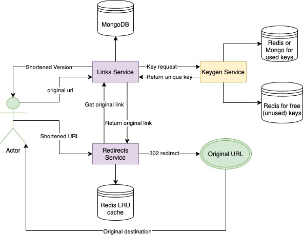

# Pocket-Link

Pocket-Link is URL shortener. URL shortening is used to create shorter aliases for long URLs. We call these shortened
aliases “short links.” Users are redirected to the original URL when they hit these short links. Short links save a lot
of space when displayed, printed, messaged, or tweeted. Additionally, users are less likely to mistype shorter URLs.

## Architecture



### Keygen service

Key Generation Service (KGS) generates random strings (with configured length) beforehand and stores them in a database.
Whenever we want to shorten a URL, we will take one of the already-generated keys and use it. This approach will make
things quite simple and fast. KGS will make sure all the keys inserted into DB are unique.

The service uses 2 DBs - the first one for free (unused) keys, and the second one for used keys.

When the client requests the key, the keygen service extracts the pre-generated key from DB with free keys and put that
key to the DB with used keys with specified TTL. When the used key is expired it is deleted from used keys and can be
used again.

For free (unused) key the Redis DB is used.

For used keys, you can configure Mongo or Redis.

The algorithm of keys generating is pretty simple. It is just a random string that is checked for uniqueness. If the
randomly generated string is duplicated it just does not store in free keys and generates the next one.

Possible chars of the key: ```-_1234567890abcdefghijklmnopqrstuvwxyzABCDEFGHIJKLMNOPQRSTUVWXYZ```

The service has a GRPC endpoint for getting the key:

```protobuf
service KeygenService {
  rpc GenerateKey (GenerateKeyRequest) returns (GenerateKeyResponse) {
  }
}

message Key {
  string val = 1;
  google.protobuf.Timestamp expire_time = 2;
}

message GenerateKeyRequest {
}

message GenerateKeyResponse {
  Key key = 1;
}
```

The service has 2 main components:

- ```Generator``` - worker that executes periodically and checks if new free keys are required. If required - generates
  new free keys.
- ```Key Service``` - interacts with database to extract new free key and provide it to the client.

#### Configuration

You can check all default values in ```docker-compose.yml``` file.

- ```TELEMETRY_COLLECTOR_ADDR``` - Address of OpenTelemetry container to collect the traces (e.g. otel-collector:55681)
- ```GENERATOR_PREDEFINEDKEYSCOUNT``` - How many free (unused) keys should be pre-generated
- ```GENERATOR_DELAY``` - How often the generator should check the amount of pre-generated free keys.
- ```GENERATOR_KEYLEN``` - Length of generated keys.
- ```GRPC_PORT``` - Port of GRPC server.
- ```REDISUNUSEDKEYS_ADDR``` - Address of Redis server. Used for storing free (unused) keys.
- ```REDISUNUSEDKEYS_DB``` - DB number of Redis server (for free keys).
- ```USEDKEYSREPOSITORYTYPE``` - Set the type of repository for used keys (```mongo``` | ```redis```).
- ```REDISUSEDKEYS_ADDR``` - Address of Redis server. Used for storing used keys.
- ```REDISUSEDKEYS_DB``` - DB number of Redis server (for used keys).
- ```MONGOUSEDKEYS_URI``` - MongoDB URI for storing used keys.
- ```KEYS_TTL``` - TTL for used keys.

### Links service

Links service stores association between original URL and the shortened one. It interacts with keygen service to get the
short version of original URL. It handles client's requests to create shortened URL. It provides original URL by the
shortened one.

Links are stored in MongoDB.

#### Endpoints

The service has 2 endpoints:

```HTTP POST /api/v1/links``` - create the shortened version of original URL.

Request example:

```json
{
  "original": "google.com"
}
```

Response example:

```json
{
  "shortened": "mYZ5MDVN",
  "original": "google.com",
  "created_at": "2021-06-24T11:58:25.7068599Z",
  "exp_at": "2021-06-24T12:58:25.6745942Z"
}
```

**GRPC endpoint** to get the original link by the shortened one (used by ```redirects``` service):

```protobuf
service LinkService {
  rpc GetLink (GetLinkRequest) returns (GetLinkResponse) {}
}

message Link {
  string original = 1;
  string shortened = 2;
  google.protobuf.Timestamp create_time = 3;
  google.protobuf.Timestamp expire_time = 4;
}

message GetLinkRequest {
  string shortened = 1;
}

message GetLinkResponse {
  Link link = 1;
}
```

#### Configuration

You can check all default values in ```docker-compose.yml``` file.

- ```TELEMETRY_COLLECTOR_ADDR``` - Address of OpenTelemetry container to collect the traces (e.g. otel-collector:55681)
- ```HTTP_PORT``` - Port of HTTP server.
- ```GRPC_PORT``` - Port of GRPC server.
- ```KEYGEN_ADDR``` - Address of ```keygen``` service.
- ```MONGO_URI``` - Mongo URI for links storing.

### Redirects service

```Redirects``` interacts with ```links``` service to get the original URL and redirects to it the user (302 HTTP
status). It caches the result in Redis with corresponding expiration time. Redis should be configured as LRU cache (see
example in docker-compose-env/docker-compose.yml ```redis-lru``` - service).

HTTP server listens on the root path "/*".

#### Configuration

You can check all default values in ```docker-compose.yml``` file.

- ```TELEMETRY_COLLECTOR_ADDR``` - Address of OpenTelemetry container to collect the traces (e.g. otel-collector:55681)
- ```HTTP_PORT``` - Port of HTTP server
- ```LINKS_ADDR``` - Address of ```links``` service.
- ```REDISLRU_ADDR``` - Address of Redis server for LRU caching.

## Build and Run

You can use docker-compose or Makefile to build/run services.

File ```docker-compose-env/docker-compose.yml``` contains all environment services (mongo, redis, etc)

```make up-env``` - run environment containers with mongo, redis, etc.

```make build-services``` - build services containers (keygen, links, redirects).

```make up-services``` - run services containers (keygen, links, redirects) and attach to logs.

## Tracing and logging

All services are traceable with OpenTelemetry. All HTTP/GRPC endpoints and client's calls are instrumented with tracing.
Each micro-service is configurable with ```TELEMETRY_COLLECTOR_ADDR``` env variable. It's an address of OpenTelemetry
Collector to collect traces.

TraceID and SpanID of each operation are injected to ```context.Context``` and to logger's fields, so almost all logs
contain that information. To get the logger with tracing fields you can use
function ```zaplogger.From(context.Context)``` (it's located in ```bricks``` module).